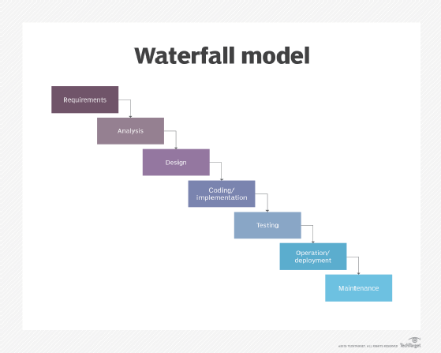
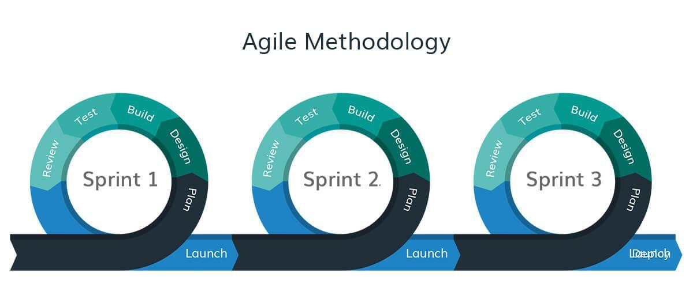
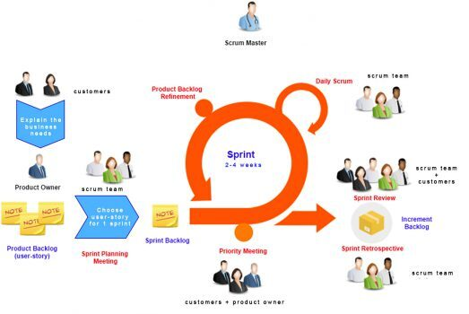

- #NOTES
- Description : All about Agile methodology
-
- ## Why Do We Need Agile
	- Waterfall method suits for monolith application
	- Waterfall is not applicable when there are changes almost everyday
	  
	  
-
- ## What Is Agile
	- 
	- Rapidly deploy an application in a much organize way
	- Small change to shift to the client
	- Constant feedback as soon as possible
	- Iterations
- ## Key Terms Of Agile
	- ### Values Of Agile
		- People over processes and tools
		- Working software over comprehensive documentation
		- Customer collaboration over rigid contracts
		- Responding to change rather than following a plan
	- ### Principles Of Agile
		- Satisfy the customer
		- Measure by working software
		- Welcome changing requirements
		- Maintain constant pace
		- Deliver working software frequently
		- Sustain technical excellence and good design
		- Frequent interaction with stakeholders
		- Keep it simple
		- Motivated individuals
		- Empower self-organizing teams
		- Face to face communication
		- Reflect and adjust continuously
- ## Advantages Of Agile
	- Persistent software delivery
	- Increased stakeholder satisfaction
	- Inspect and adapt
	- Welcome to changes at any stage
	- Design is important
	- Daily interaction
- ## How To Implement Agile (Framework)
	- ### Scrum
	- 
	- Constant iteration of plan -> build -> test -> review
		- #### Stakeholder
			- Outside the scrum team, customer
		- #### Product Owner
			- Manager, make sure the app deployed and committed. make sure the app is built it has to be. does not mean a technical person
		- #### Scrum Master
			- Team leader, running meetings, review tasks
		- #### Team
		- #### Product Backlogs
			- Smaller tasks (plan -> build -> test -> review)
			- Done over a period of time
			- Bits of features
			- Product owner and scrum master are the ones to determine the backlogs
### user stories
- a single product backlog is called a user story
### sprint planning
- product owner explains how is the end goal
### sprint backlog
- prioritized user stories. what to work on first
### daily scrum
- daily meeting
### sprint review
- end of the user story. each and every user story usually ends in 2 weeks
### sprint retrospective
## eXtreme programming
## LEAN
## KANBAN

![[kanban system.jpg]]
- continuous implementation. no sprint
## CRYSTAL