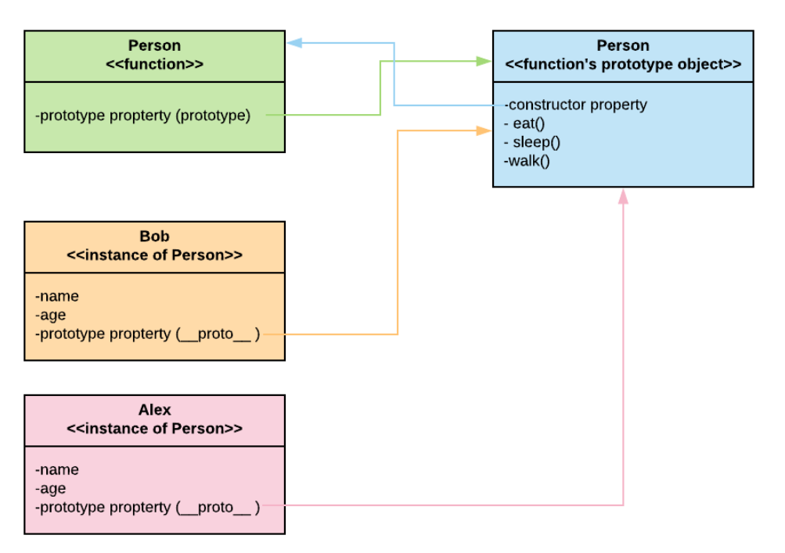

- #Dev-Notes #Javascript
- Description : Javascript object oriented notes
-
- ## Introduction
	- Javascript has object and in each object contains properties and methods
	- Other predefined methods are in __proto__ object
- ## Object Literals
	- In es6, functions can be shortened instead of the normal "= function(){}" like in the example below
	- ``` js 
	  	var user = {
	  email: 'test@email.com',
	  name: 'Philip',
	  login(){
	  	console.log(this.email, " has logged in");
	  },
	  logout(){
	  	console.log(this.email, " has logged out");
	  },
	  	}
	  
	  	console.log(user.name);
	  	user.login();
	  	user.logout();
	  ```
- ## Updating Properties
	- Properties can be set by assigning the value to the properties user.name = "Stellar"
	- Or user\["name"\] = "Stellar" to have more flexibility (place the property value in variable inside the brackets)
- ## Classes
	- In es6, javascript has a **"class"** keyword that can be initialized like "var user = new User()". but javascript actually has no class concept and is just a syntactic sugar. best approach is to use **"__proto__"**
	- ### Class
		- Class has constructor function (uses constructor function)
		- Always use this keyword when referring to the properties of the object
		- Methods in the class can also be seen in the **"__proto__"** object
		- ``` js 
		  	class User {
		  	constructor(email, name){
		  		this.email = email;
		  		this.name = name;
		  	}
		  	login(){
		  		console.log(this.email, " just logged in");
		  	}
		  	logout(){
		  		console.log(this.email, " just logged out");
		  	}
		  	}
		  
		  	var user = new User("test@email.com", "Philip");
		  ```
		- ### Method Chaining
			- Return the object in the method like "return this"
			- Like a builder pattern
			- ``` js 
			  	class User {
			  	constructor(email, name){
			  		this.email = email;
			  		this.name = name;
			  		this.score = 0;
			  	}
			  	login(){
			  		console.log(this.email, " just logged in");
			  		return this;
			  	}
			  	logout(){
			  		console.log(this.email, " just logged out");
			  		return this;
			  	}
			  	updateScore(){
			  		this.score++;
			  		console.log(this.email, " score is now ", score);
			  		return this;
			  	}
			  	}
			  
			  	var user = new User("test@email.com", "Philip");
			  ```
		- ### Class Inheritance
			- ``` js 
			  
			  	class User {
			  	constructor(email, name){
			  		this.email = email;
			  		this.name = name;
			  		this.score = 0;
			  	}
			  	login(){
			  		console.log(this.email, " just logged in");
			  		return this;
			  	}
			  	logout(){
			  		console.log(this.email, " just logged out");
			  		return this;
			  	}
			  	updateScore(){
			  		this.score++;
			  		console.log(this.email, " score is now ", score);
			  		return this;
			  	}
			  	}
			  
			  	class Admin extends User {
			  	deleteUser(user){
			  		users = users.filter(u => {
			  			/* 
			  				filter the user that is not equal to the given paramter. 
			  				also not good accessing arrays outside the object
			  			*/
			  			return u.email != user.email; 
			  		});
			  	}
			  	}
			  
			  	var firstUser = new User("test@email.com", "Philip");
			  	var secondUser = new User("test@email.com", "Philip");
			  
			  	var users = [firstUser, secondUser];
			  	admin.deleteUser(secondUser); 
			  	admin.login(); // still works because all are inherited
			  
			  ```
- ## \__proto__
	- every object in Javascript has a prototype
	- Javascript adds an extra property called *prototype* to the created function
	- ### Constructor Function Objects
		- The ***prototype*** that is an object (called as prototype object) has a ***constructor*** property by default
		- The ***constructor*** property points back to the function object on which the ***prototype*** object is a property
		- 
		- ***prototype*** property points to the Prototype object of the function
		- Use \<function name\>.prototype to access the function's prototype property
		- From the prototype of the function, use \<function name\>.prototype.constructor to access the function object back
		- In the above image, the person object has a prototype object. inside the prototype object, it has a constructor object. the constructor object points back to the person object instance.
		- Thus the following comparisons are true :
		- ``` js 
		  	console.log(Person.prototype.constructor === Person); //prints true
		  	console.log(Person.prototype === Person.prototype.constructor.prototype); //prints true
		  ```
		- When an instance of an object is created, javascript adds the prototype object in the instance referencing the prototype object of the function object
		- Methods can be added in the prototype of Person
		- ``` js 
		  	function Person(name, age) {
		  this.name = name;
		  this.age = age;
		  	};
		  
		  	Person.prototype.eat = function() {
		  console.log(name, " is eating");
		  	}
		  
		  	Person.prototype.sleep = function() {
		  console.log(name, " is sleeping");
		  	}
		  ```
		- For example, using **new** keyword to create a new instance of Person named Bob, the properties of Person will be added to the Bob instance, but the methods are in the prototype object of Bob. Since the methods are added in the Person prototype object, any created instance of Person will have the methods in the prototype object that is referencing back to the Person prototype object
		- 
		- So the prototype of Person should be equal to the prototype object of Bob
		- ``` js 
		  	console.log(Bob.__proto__ === Person.prototype); //prints true
		  ```
		- Creating another instance of Person named Alex
		- 
		- Alex instance prototype object should be equal to Bob prototype
		- ``` js 
		  	console.log(Bob.__proto__ === Alex.__proto__); //prints true
		  ```
	- ### Prototype Chain
		- Javascript has built-in objects like Object (all object's parent), Array, Date, Function, etc. and each of these objects will have respective prototype objects attached to it
		- All objects leads to one parent, the Object
		- Given an object apple, the apple object prototype is equal to the Object prototype
		- ``` js 
		  	const apple = {};
		  	console.log(apple__proto__ === Object.prototype);
		  ```
		- Since the apple object is an object literal, it has no constructor object
		- Constructor object only exists in constructor functions
		- ``` js 
		  	function Car(maxSpeed, driver){
		  this.maxSpeed= maxSpeed;
		  this.driver = driver;
		  this.parked = false;
		  	};
		  
		  	Car.prototype.park = function(){
		  this.parked = true;
		  	}
		  
		  	Car.prototype.drive = function(speed, time){
		  console.log(speed * time);
		  	}
		  
		  	function FamiliyCar(...args){
		  User.apply(this, args); 
		  this.role = "super admin";''
		  	}
		  
		  	Object.setPrototypeOf(FamilyCar.prototype, Car);
		  
		  	function CarWithChildLock(){};
		  
		  	Object.setPrototypeOf(CarWithChildLock.prototype, FamiliyCar);
		  
		  	let car = new CarWithChildLock();
		  
		  	// car.constructor is equal to the constructor function CarWithChildLock(){} (the CarWithChildLock object)
		  	// car.constructor.prototype and car.__proto__ are equal and is the object literal CarWithChildLock{}.
		  
		  	console.log(car.__proto__); // prints the object literal CarWithChildLock{}
		  	console.log(car.__proto__.__proto__); // prints the object literal FamilyCar{}
		  	console.log(car.__proto__.__proto__.__proto__); // prints the object literal Car{}
		  	console.log(car.__proto__.__proto__.__proto__.__proto__); // prints the object literal Object{}
		  	console.log(car.__proto__.__proto__.__proto__.__proto__.__proto__); // prints null
		  
		  
		  ```
	- ### \__proto__ inheritance
	  
	  ``` js 
	  	function Car(maxSpeed, driver){
	  this.maxSpeed= maxSpeed;
	  this.driver = driver;
	  this.parked = false;
	  	};
	  
	  	Car.prototype.park = function(){
	  this.parked = true;
	  	}
	  
	  	Car.prototype.drive = function(speed, time){
	  console.log(speed * time);
	  	}
	  
	  	// array of parameters
	  	function FamiliyCar(...args){
	  // apply method of prototype is used to invoke the function (in this case a constructor function), as every function is an object and has a prototype object. The parameters are the object invoker (this or any object reference) and the array of arguments.
	  
	  User.apply(this, args); 
	  this.role = "super admin";''
	  	}
	  
	  	// additional method for familiy car
	  
	  	FamilyCar.prototype.slowDown = function(){
	  
	  	}
	  
	  	// methods are not automatically inherited. the following inherits the methods from car.
	  
	  	FamilyCar.prototype = Object.create(Car.prototype);
	  
	  	//or
	  
	  	Object.setPrototypeOf(FamilyCar.prototype, Car.prototype);
	  
	  ```