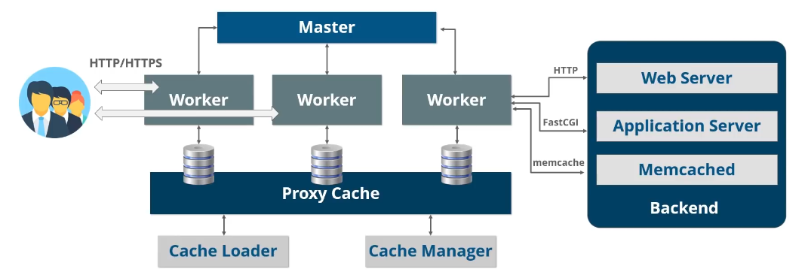

- #Dev-Notes
- Description : NGINX notes
-
- ## What Is A Web Server
	- Handles https request. not a servlet container, still need tomcat
- ## What Is NGINX
	- An open source software
	- Web server for reverse proxying, caching, and load balancing
	- Provides http server capabilities
	- Designed for maximum performance and stability
	- Functions a proxy server for email (imap, pop3, and smtp)
	- Uses a non-thread and event driven software
- ## NGINX architecture
	- 
	- ### Master
		- Only 1 master node
		- Responsible for reading and validating configuration
		- Creating binding and crossing sockets
		- Responsible for terminating and maintaining the configured number of worker processes
		- Responsible for reconfiguring without any service interruption
		- Controls non-stop binary upgrades and reopening of the log files
		- Compiles embedded Perl scripts
	- ### Worker
		- Single thread processes
		- Handles thousands of concurrent connections every seconds
		- Accepts new requests from a shared list of socket and execute a highly efficient run loop inside each work process
	- ### Proxy Cache
		- #### Cache Loader
			- Mainly responsible for checking the on disk cache items and populating engine in-memory database with the cache metadata
			- Prepares engine instances to work  with files already stored in the disk
			- Checks cache contents with the metadata
			- Updates the relevant entries in shared memory
		- #### Cache Manager
			- Responsible cache expiration and validation
			- Restarted by the master node in case of failure
			- Visited page are stored in the cache so that revisiting it again will be retrieved in the cache and will not go to the whole process
	- ### backend
		- #### webserver
		- #### application server
### memcached
# why use nginx
- ease of installation and maintenance
- improves performance
- reduces the wait time for users
- load balancing
- on the  fly upgrade
# configuration settings
## worker_processes
- defines the number of processes
## worker_connections
- maximum number of simultaneously connections served by nginx
## access_log & error_log
- access log events and errors
## gzip
- gzip compressions
# installing nginx
## install nginx
- sudo wget http://nginx.org/keys/nginx_signing.key (get nginx key)
- sudo apt-key add nginx_signing.key (add nginx key to apt)
- sudo vi /etc/apt/sources.list.d/nginx.list
- sudo add nginx repository (set the correct linux distro installed)
- sudo apt update
- sudo apt-get update
- sudo apt-get install nginx
- nginx -v (check if nginx installed)
## adjust firewall
- sudo ufw enable (enable firewall)
- sudo ufw app list (list available apps)
- sudo ufw allow 'Nginx Full'
- sudo ufw allow 'Nginx HTTP'
- sudo ufw allow 'Nginx HTTPS'
## check server
- sudo ufw status (check firewall status)
- sudo systemctl status nginx (check nginx service)
- sudo systemctl enable nginx (if nginx is disabled)
- systemctl restart nginx (restart nginx)
- systemctl stop nginx (stop nginx)
- systemctl start nginx (start nginx)
- systemctl reload nginx (reload conf files without restart the whole service)
## manage nginx process
- cd /etc/nginx (nginx directory, contains confs)
- sudo vi nginx.conf (open nginx conf)
- sudo vi conf.d/default.conf (open default conf file for the defaul nginx page, server block, conf per web app)
## reverse proxy
- setup first the host to proxy to (nodejs, docker, snap package, java app, or a web host)
- cd /etc/nginx/conf.d
- sudo vi <conf_name>.conf (setup the conf, location.proxy_pass is used to set the proxy)
- sudo mv default.conf default.conf.disabled (rename default.conf to disable)
- nginx -t (test confs)
- nginx -s reload (reload confs)
## load balancer